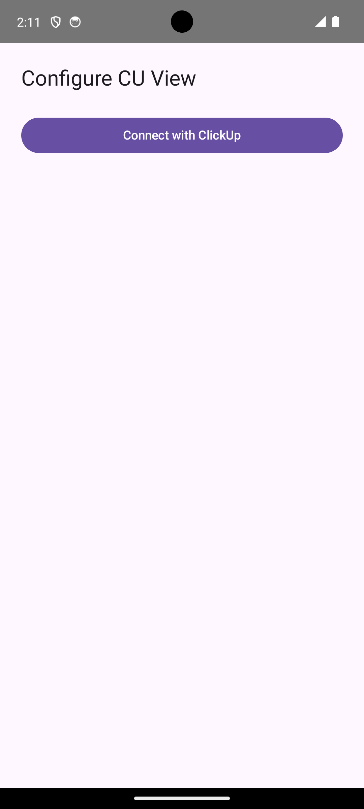
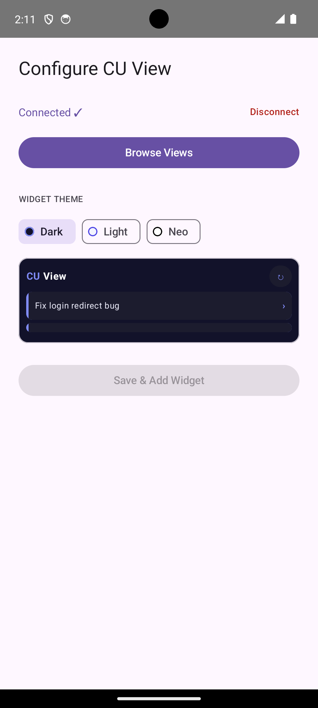
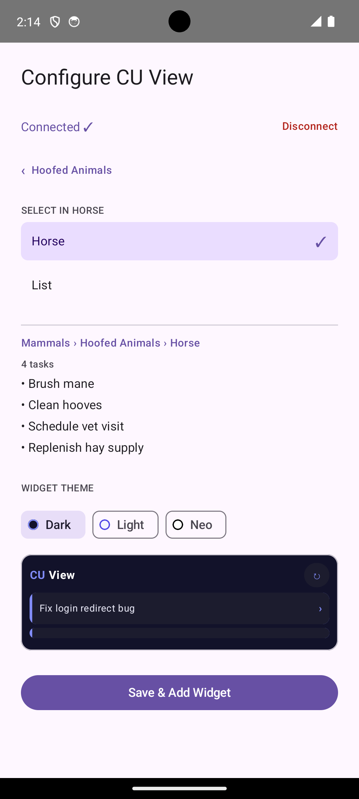
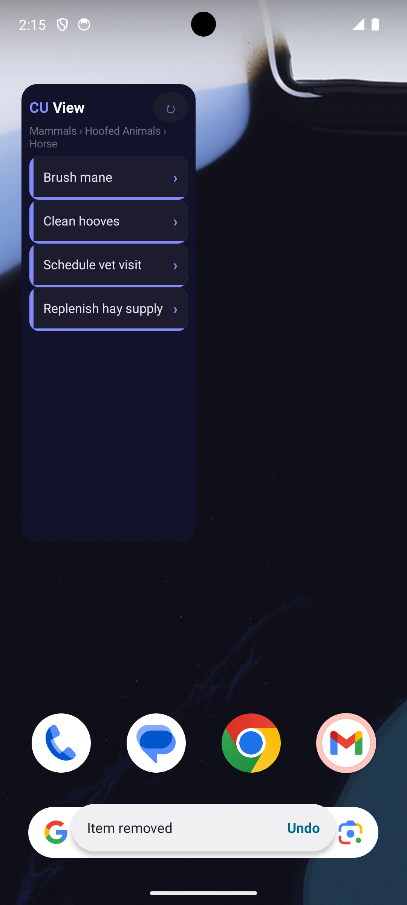

# CUeView

An Android home screen widget that displays your [ClickUp](https://clickup.com) tasks at a glance.

## Features

- Pin any list or view as a widget
- Live task list synced every 15 minutes with a manual ↻ refresh button
- Offline resilience — stale tasks are preserved on sync failure; an error banner appears instead of an empty widget
- Tap any task to open it directly in the ClickUp app (or browser)
- Secure credential storage using `EncryptedSharedPreferences` (Tink key derivation)
- OAuth 2.0 authentication via Chrome Custom Tab

## Screenshots

| Connect | Browse | Preview | Widget |
|---------|--------|---------|--------|
|  |  |  |  |

## Requirements

- Android 8.0 (API 26) or higher
- A ClickUp account with at least one workspace

## Getting Started

1. Long-press your home screen and add the **CUe View** widget.
2. Tap **Connect Workspace** — a Chrome Custom Tab opens the ClickUp OAuth page.
3. After authorizing, browse your space → folder → list hierarchy and select a list or view.
4. Tap **Save** — the widget populates with your tasks immediately.

To reconfigure, long-press the widget and select **Edit Widget** (launcher-dependent label).

## Build

Gradle requires **JDK 21** — JDK 17 and JDK 25 are not supported.

```bash
make install                     # debug build with mock API (no real ClickUp calls)
USE_MOCK_API=false make install  # debug build with real ClickUp API
make build-release               # release build (requires keystore in local.properties)
```

The debug build defaults to `USE_MOCK_API=true`, which serves fake tasks without requiring real OAuth credentials. Use `USE_MOCK_API=false` to test the real OAuth and sync flow.

### Module layout

| Module | Description |
|--------|-------------|
| `:app` | Widget application |
| `:lint-rules` | Custom `GlanceDpDetector` lint rule — catches raw `Int` dimensions passed to Glance (would crash at runtime) |

## Testing

### Unit tests

```bash
./gradlew :app:test
```

Uses Robolectric for tests that need Android context; plain JUnit for pure Kotlin logic.

### Lint

```bash
./gradlew :app:lintDebug         # full lint including custom Glance check
./gradlew :lint-rules:test        # lint rule unit tests
```

### End-to-end tests (Maestro)

[Maestro](https://maestro.mobile.dev/) 1.40.0 must be installed at `~/.maestro/bin/maestro`.

```bash
make e2e        # build + install + run all flows (clears state between each)
make e2e-fast   # run all flows without rebuilding or clearing state
```

| Flow | Description |
|------|-------------|
| `01_disconnect_reconnect.yaml` | Full happy path + regression: place widget → connect → disconnect → reconnect → browse → save |
| `02_cancel.yaml` | Regression: place widget → back-press → verify no broken widget slot left behind |
| `03_reconfigure.yaml` | Reconfigure existing widget: change theme to Light + change view → save |

## CI

| Workflow | Trigger | What it does |
|----------|---------|--------------|
| `unit-tests.yml` | PR to `main` | Runs unit tests |
| `detekt.yml` | PR to `main` | Static analysis (Detekt) |
| `codeql.yml` | PR to `main` | CodeQL security scan |
| `gitleaks.yml` | PR to `main` | Secret scanning |
| `license-check.yml` | PR to `main` | License header check |
| `e2e.yml` | PR touching `app/` or `e2e/` | Boots emulator, runs all Maestro flows with mock API |
| `release.yml` | Push to `main` | Creates release PRs and GitHub releases via `release-please` |

## Glance gotchas

- **Always use `.dp` / `.sp`** for dimensions — `padding(8)` treats the `Int` as a `@DimenRes` and crashes at runtime. The `:lint-rules` module catches this at build time.
- **Imports must be `androidx.glance.*`**, not `androidx.compose.*` — mixing causes silent runtime crashes.
- **Colors** must use `ColorProvider(R.color.x)` — hardcoded `Color(0xFF…)` values ignore system dark/light mode.
- **`LazyColumn`** translates to a `RemoteViews ListView` — keep items ≤ 15 and layouts simple.

## License

MIT License
